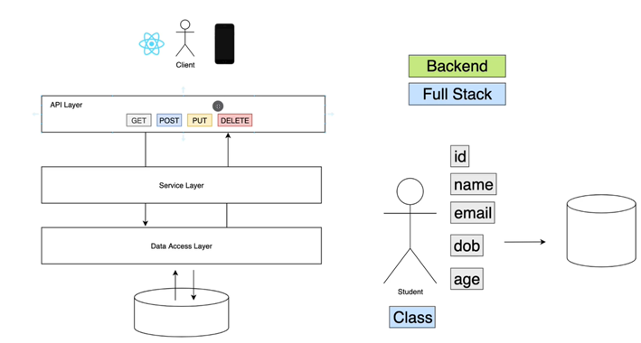

# Getting start with Spring Boot

This API was build during the course "Getting start with Spring Boot" from [amigoscode] (http://amigoscode.com/)

The goal was make an API in Java that let us to add, get the list, edit and delete students.

First, we make the class Student with the attributes (Id, name, email, dob(date of birth) and age with the construct, setters, getters and toString.

Then we create the studentController class, that contains all our methods to return data or get data from our API.

We created the studentConfig class to add 2 students every time we run our application (every "run" we drop the old and create a new one).

The studentRepository extends JpaRepository interface, to allow us to use various methods to find,delete,save...it interacts directly with our PostgreSQL database.

Last, but not least, we created the studentService class to make the use of the respository class, calling the methods we need, making the verification if the id exists, if it's not null and trowing exceptions when needed.

It was a great knowledge and this is just the beginning!

